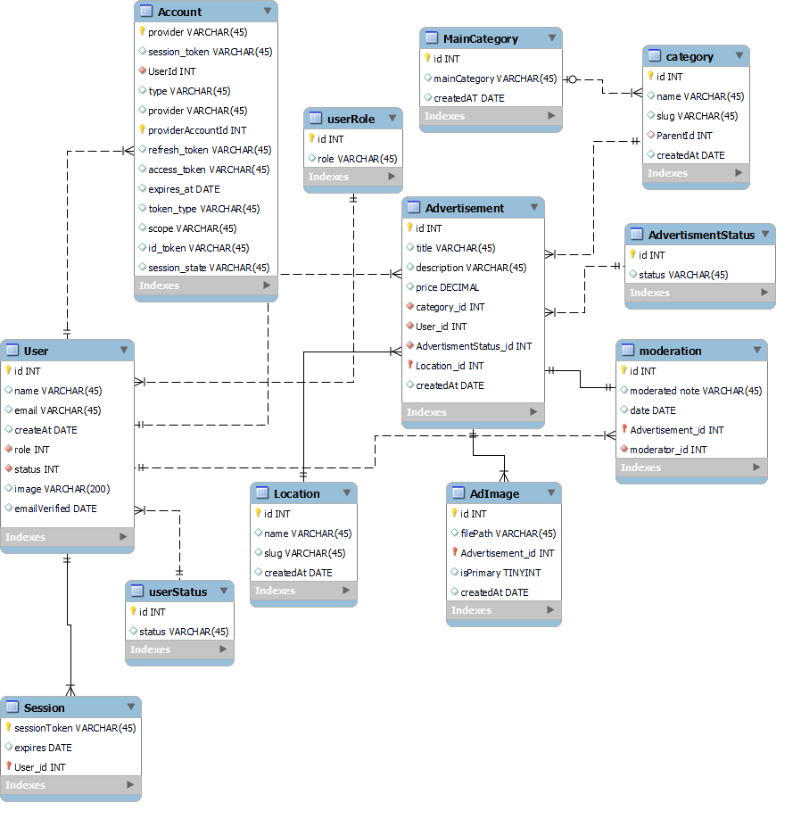

# Bliq Advertisements Platform

A full-stack classified advertisements MVP built with Next.js,
PostgreSQL and Prisma. Users can authenticate with Google,
submit advertisements with images, browse and filter public
listings, and manage their own advertisements.

Moderators review pending advertisements and approve or reject
them. Sellers receive moderation-result emails through AWS SES.

## Database ER Diagram

The following diagram shows the main database entities and their relationships.

## Features

- Google OAuth authentication using Auth.js
- USER and MODERATOR role-based access control
- Suspended-account restrictions
- Hierarchical categories
- Advertisement submission with Zod validation
- Local image uploads
- Pending, active and rejected advertisement lifecycle
- Moderator approval and rejection workflow
- Rejection explanations
- AWS SES moderation emails
- Keyword, category, location and price filters
- Prisma relationLoadStrategy: "join"
- Seller contact details hidden from guests
- Soft deletion with ownership protection

## Technology Stack

- Next.js App Router
- React
- TypeScript
- Tailwind CSS
- Shadcn UI
- PostgreSQL
- Prisma ORM
- Auth.js / NextAuth
- Google OAuth
- AWS SES
- Nodemailer
- Zod

## Access Control

### Guest
Can browse, search and view public advertisements.
Cannot view seller contact details.

### User
Can create advertisements, view their submission status,
see rejection reasons and remove their own advertisements.

### Moderator
Can access the moderation dashboard and approve or reject
pending advertisements.

## Advertisement Lifecycle

1. A registered user submits an advertisement.
2. The advertisement is stored with PENDING status.
3. A moderator reviews the submission.
4. Approval changes the status to ACTIVE.
5. Rejection changes the status to REJECTED and stores a reason.
6. The seller receives an AWS SES email.
7. Only ACTIVE advertisements belonging to ACTIVE sellers appear publicly.

## Local Setup

1. Clone the repository.
2. Install dependencies:

npm install

3. Copy `.env.example` to `.env`.
4. Configure PostgreSQL, Google OAuth and AWS SES.
5. Run migrations:

npx prisma migrate dev

6. Seed categories and locations:

npx prisma db seed

7. Start the development server:

npm run dev

## Creating a Moderator

1. Sign in once using Google so the user record is created.
2. Open Prisma Studio:

npx prisma studio

3. Find the user record.
4. Change the role from USER to MODERATOR.
5. Save the record and sign in again.

## AWS SES setup

- Configure the AWS region and credentials.
- Verify the sender email address in AWS SES.
- Set the verified sender as `SES_FROM_EMAIL`.
- In SES sandbox mode, recipient addresses may also need verification.

## Security

- Server Actions verify authentication and account status.
- Moderator actions require the MODERATOR role.
- Advertisement deletion includes both advertisement ID and owner ID.
- Public queries exclude deleted advertisements and suspended sellers.
- Pending and rejected advertisements cannot be accessed publicly.
- Guest users never receive seller contact details.
- Login callback paths are validated before redirecting.

## Known Limitations

- Images are stored locally under `/public/uploads/ads`.
- There is no cloud object storage integration.
- Advertisement removal is implemented as soft deletion.
- Automated test coverage is not yet included.
- Moderator promotion is performed manually through Prisma Studio.